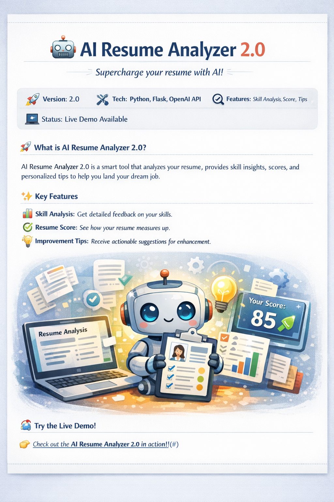

# 📄 AI Resume Analyzer

An AI-powered resume analyzer that compares your resume against a job description and gives you a match score, skill gap analysis, and improvement suggestions.

---





## 🚀 How to Run

### ▶️ Option 1 — Streamlit (Recommended, Ready to Run)
```bash
pip install -r requirements.txt
streamlit run app.py
```

Then open `http://localhost:8501` in your browser.

---

### ▶️ Option 2 — Flask (Requires Code Update)

The project originally used Flask. To switch back to Flask:

1. In `app.py`, replace the Streamlit code with Flask routes
2. Add `from sentence_transformers import SentenceTransformer, util` and initialize `model = SentenceTransformer('all-MiniLM-L6-v2')`
3. Run with:
```bash
python app.py
```

Then open `http://localhost:5000` in your browser.

---

## 🛠️ Tech Stack

- **Python**
- **Streamlit** (current UI)
- **PyMuPDF (fitz)** — PDF text extraction
- **spaCy / utils.py** — Entity & skill extraction
- **Keyword Matching** — Resume vs JD scoring

---

## 📁 Project Structure
```
AI Resume Analyzer/
├── app.py               # Main app (Streamlit)
├── utils.py             # Entity extraction logic
├── templates/
│   ├── index.html       # Flask UI (if switching to Flask)
│   └── result.html      # Flask result page
├── static/uploads/      # Uploaded resumes
├── requirements.txt
└── README.md
```

---


## ⚙️ Installation
```bash
git clone https://github.com/YOUR_USERNAME/ai-resume-analyzer.git
cd ai-resume-analyzer
python -m venv .venv
.venv\Scripts\activate      # Windows
pip install -r requirements.txt
streamlit run app.py
```

---

## 📌 Note

Make sure your `requirements.txt` is up to date before pushing:
```bash
pip freeze > requirements.txt
```
🎯 Use Case

- Students preparing for placements

- Freshers applying for internships

- Professionals optimizing resumes

- AI/NLP portfolio demonstration

📌 Future Improvements

- Resume-to-Job Description Matching

- ATS Compatibility Checker

- Grammar Enhancement using LLM

- Dashboard with Skill Analytics

- Deployment on Streamlit / Render
